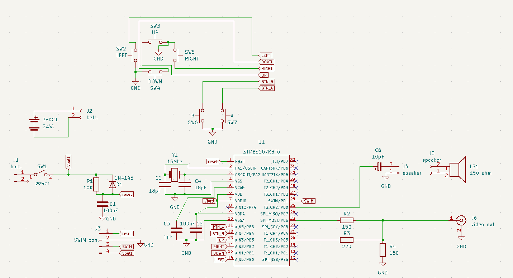
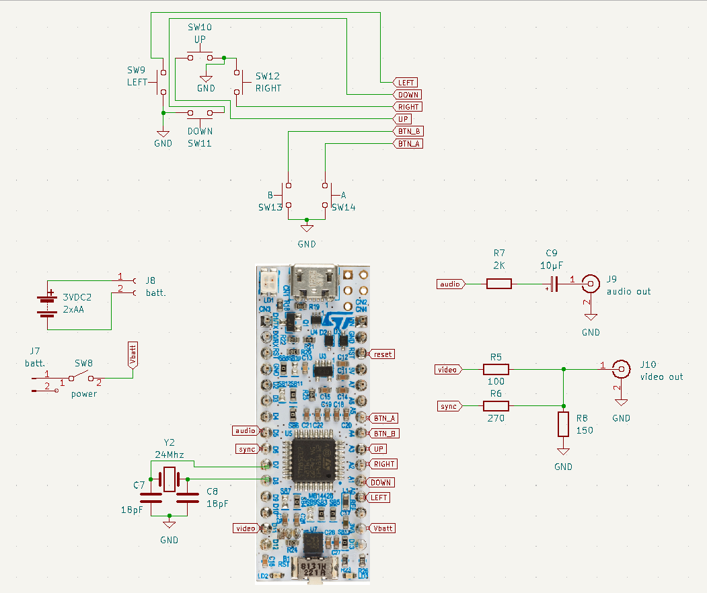

# stm8 gamepad

Console jeu rétro réalisée sur carte NUCLEO-8S207K8. 

## Caractéristiques

* Sortie vidéo composite NTSC 
* Affichage 200x192 pixels noir & blanc.
* pad de 6 boutons croix et boutons A, B.
* Petit haut-parleur pour tonalités et bruit blanc.

## Documentation

[api.md](api.md)

[docs/api.pdf](docs/api.pdf)

## Prototypes

J'ai fabriqué 2 prototypes.  Le premier est réalisé avec un stm8s207k8 et le 2ième avec une carte NUCLEO-8S207K8. Pour ceux qui n'ont pas de programmeurs ST-LINK la 2ième option s'impose.

### Prototype 1

L'ensemble tient sur une seule carte.

### Prototype 2

La carte des boutons est enfichée par dessus la carte du circuit principal. De plus il n'y a pas de haut-parleur installé mais plutôt une sortie phono RCA (blanc) pour l'audio.

