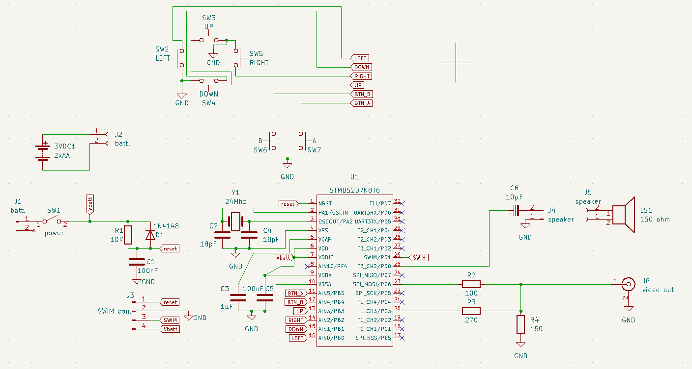

# stm8 gamepad

Console jeu rétro réalisée sur carte NUCLEO-8S207K8. 

## Caractéristiques

* Sortie vidéo composite NTSC 
* Affichage 200x192 pixels noir & blanc.
* pad de 6 boutons croix et boutons A, B.
* Petit haut-parleur pour tonalités et bruit blanc.

## Documentation

[api.md](api.md)

[docs/api.pdf](docs/api.pdf)

## Prototypes

J'ai fabriqué 2 prototypes.  Le premier est réalisé avec un stm8s207k8 et le 2ième avec une carte NUCLEO-8S207K8. Pour ceux qui n'ont pas de programmeurs ST-LINK la 2ième option s'impose.

### Prototype 1

L'ensemble tient sur une seule carte.

### Prototype 2

La carte des boutons est enfichée par dessus la carte du circuit principal. De plus il n'y a pas de haut-parleur installé mais plutôt une sortie phono RCA (blanc) pour l'audio.

## Mise à jours

### 2024-02-16, V1.5R0

J'ai effectué 2 modficications au circuit ainsi que les modifications logicielles requises par ces changements.

1. La résistance de **150 ohm** à la sortie vidéo a été remplacée par une résistance de **100 ohm** pour augmenter la luminosité.
1. Le cristal de **16Mhz** a été remplacé par un cristal de **24Mhz**. Ceci a 3 conséquences.
    * le rapport largeur/hauteur de l'image qui étirait les pixels en largeur est maintenant très proche ce l'unité donc la routine **circle** n'a plus besoin de faire une correction et le bitmap du chien qui s'affiche au démarrage a un aspect plus normal.
    * l'image n'occupe plus que les 2/3 de la largeur de l'écran. Ça implique que du temps est libéré (environ 17µSec/scan line) donnant plus temps d'exécution au cpu pour les autres tâche.
    * La vitesse d'exécution est augmenter.

